# emacs 使用手册


## 配置securecrt


这里securecrt的配置主要分为四个部分：

+ 终端模式
+ Alt键兼容
+ delete键处理
+ 字符集utf-8、字体大小设置

点击SecureCRT的Option =>Global Options， 弹出Global Options设置窗口

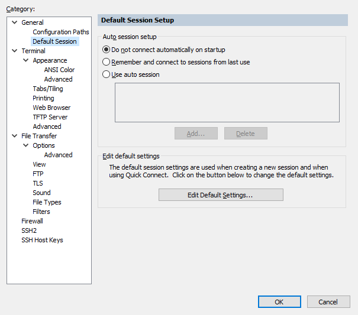

 点击General=>Default Session,  出现上图右侧的窗口，然后单击"Edit Default Settings...", 弹出Session Options-Default窗口。


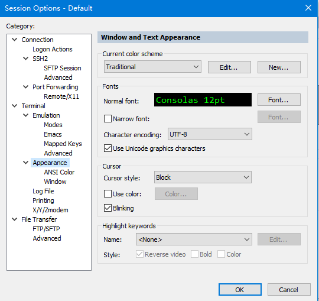


1. 选中左侧的Termianl => Emulation, 按照如下的方式完成终端模拟器设置。

   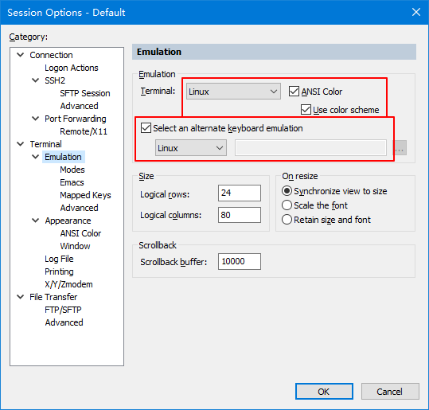

2. 选中左侧的Terminal => Emulation => Emacs, 按照如下方式完成Emacs的Alt键兼容设置

   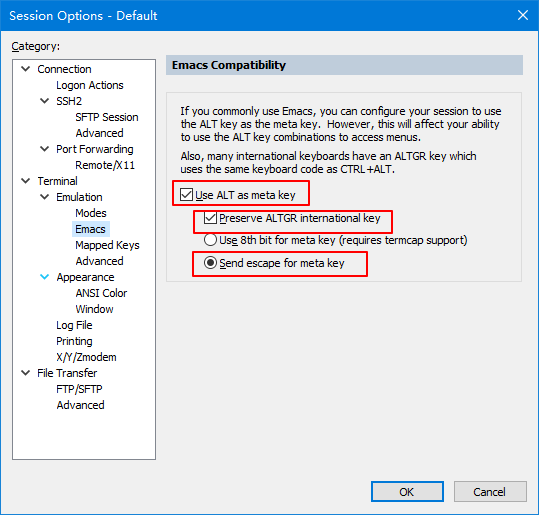

3. 选中Termianl => Emulation => Mapped Keys, 按照如下的方式完成emacs的delete键兼容设置

   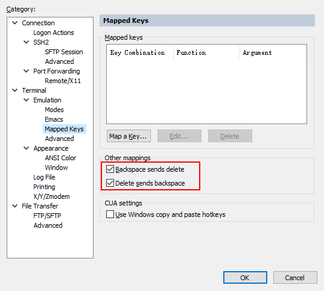

4. 选中Terminal => Apprearance， 按照如下的方式完成终端的字体，字符集，字体大小设置

   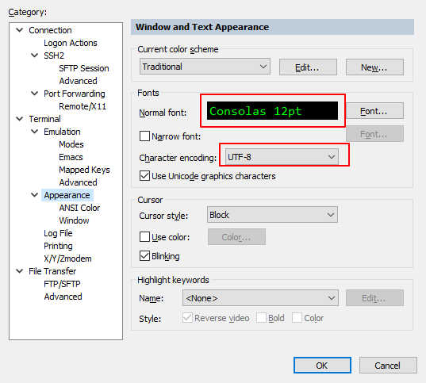

## emacs的安装

###  centos系统上安装

1. 安装依赖环境

   ```bash
   sudo yum install "Development Tools" libXpm-devel libpng-devel giflib-devel libtiff-devel libjpeg-devel ncurses-devel libXft-devel pkgconfig  gpm-devel dbus-devel dbus-glib-devel dbus-python gconf2-devel lrzsz xclip -y
   ```

2. 下载安装包git、emacs

   ```bash
   wget http://mirrors.ustc.edu.cn/gnu/emacs/emacs-25.3.tar.gz -O /tmp/emacs.tar.gz
   wget https://www.kernel.org/pub/software/scm/git/git-2.9.5.tar.gz -O /tmp/git.tar.gz
   ```

3. 建立自己的app安装目录, 并且设置环境变量

   ```bash
   mkdir ~/app
   echo 'export PATH=${HOME}/app/bin:${PATH}' >> ${HOME}/.bash_profile
   source ${HOME}/.bash_profile
   ```

4. 安装git

   ```bash
   cd /tmp
   tar xvf git.tar.gz
   cd git-*
   ./configure --prefix=${HOME}/app
   make && make install
   ```

5. 安装emacs

   ```bash
   cd /tmp
   tar xvf emacs.tar.gz
   cd emacs-*
   ./configure --prefix=${HOME}/app --without-x
   make && make install
   ```

6. 下载emacs配置文件

   ```bash
   cd ${HOME}
   rm -rf ${HOME}/.emacs
   git clone https://github.com/CharellKing/.emacs.d.git
   ```

7. 启动emacs，会去自动安装插件，等待安装完成

   ```bash
   emacs
   ```

   ​

## 使用emacs

###  窗口介绍

+ 编辑窗口
+ powerline，状态栏
+ 命令窗口（最底部）

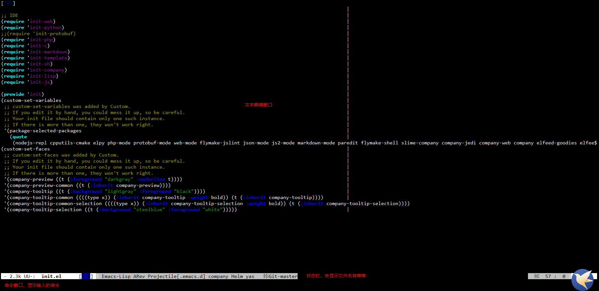


### 常用快捷键介绍

**这里C对应ctrl键、S对应Shift键、M对应Alt键 **

+ 打开文件或者创建文件

  ```elisp
  C-x C-f
  ```

+ 保存文件

  ```elisp
  C-x C-s
  ```

+ 光标上移动

  ```
  C-p
  ```

+ 光标下移动

  ```
  C-n
  ```

+ 光标后移动

  ```
  C-b
  ```

+ 光标前移动

  ```
  C-f
  ```

+ 光标移动到第一行

  ```
  M-S-<
  ```

+ 光标移动到最后一行

  ```
  M-S->
  ```

+ 光标跳转到指定行

  ```
  M-g g [输入指定的行号]
  ```

+ 光标跳转到刚修改的行

  ```
  C-c g c
  ```

+ 查找文本

  ```
  C-s
  ```

+ 标记文本

  ```
  C-@ #然后按上面的快捷键移动光标，可以实现多行选中
  ```

+ 复制

  ```
  M-w
  ```

+ 剪贴

  ```
  C-w
  ```

+ 粘贴

  ```
  C-y
  ```

+ 撤销，可以撤销任何命令

  ```
  C-g
  ```

  ​

### magit用法（结合git用）

+ 启动magit， 键入M-x,  然后输入magit-status, 会弹出另外一个框

  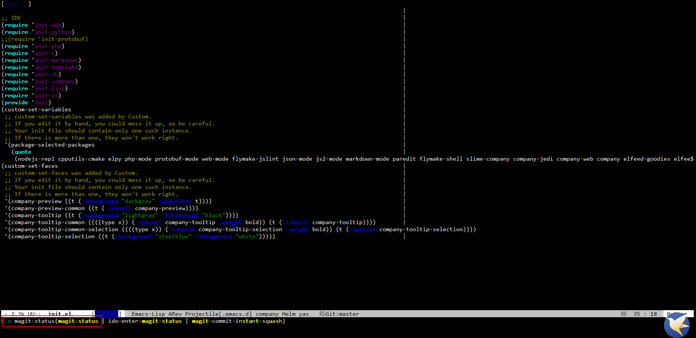

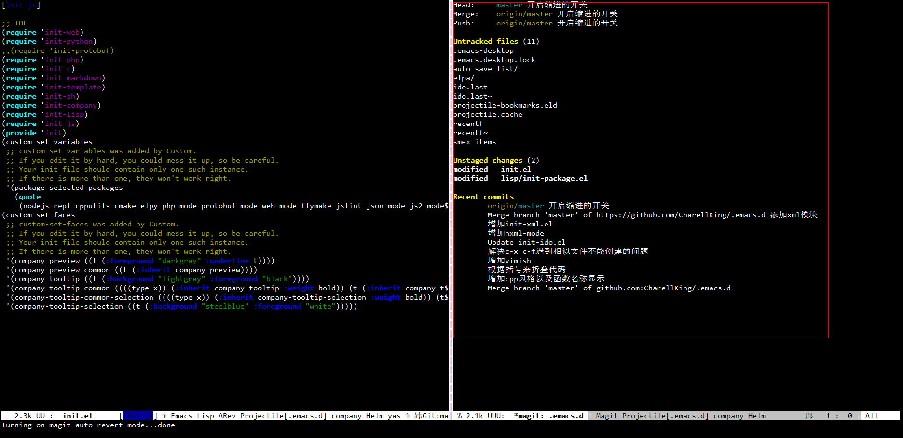


+ 介绍右边的窗口的相关项

  Untracked files: 新建的文件或者文件夹，不存在与工程中

  Unstaged changes：为刚修改的文件，未git add到工程中

  Staged changes: 刚add的文件，待commit

  Recent Commits: 最近的提交信息

+ 移动光标到修改的文件项目，然后按照s，add文件（对应git add); 如果你想取消add，可以将光标移动到对应已经add的文件，然后按u。

  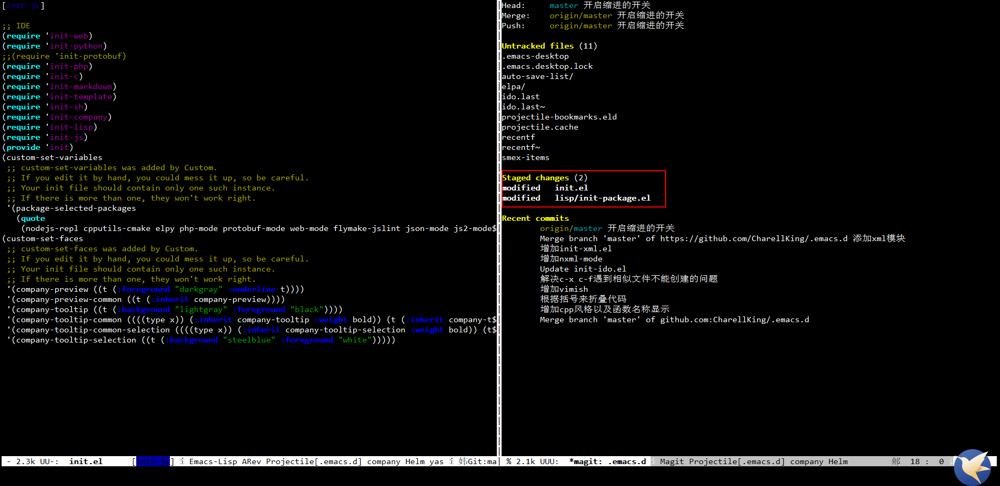

+ 已经add（git add）所有已经修改的文件之后， 按C-c C-c快捷键，弹出一个框， 然后紧接着按c，就会commit了

  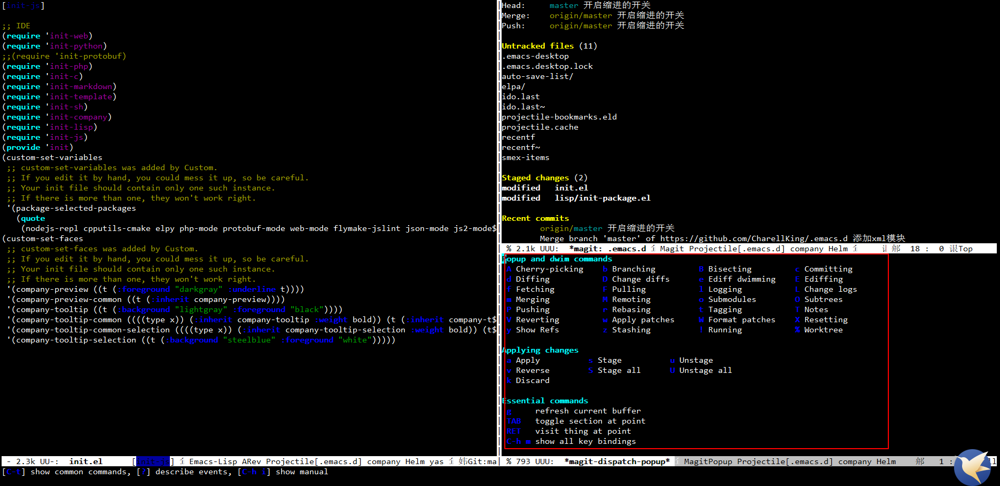

+ 接下来，在对应的窗口的编写修改的描述（例如：这是一个测试样例), 然后C-c C-c

  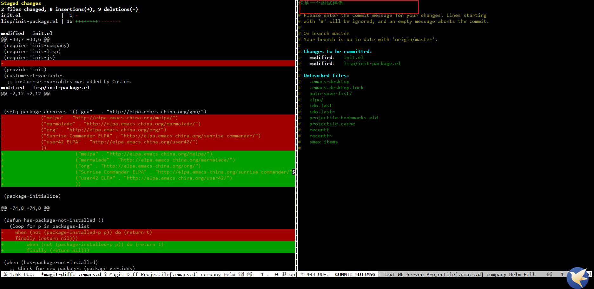

+ 最后将本地commit的修改信息，push到远程git仓库，先按P, 然后再p就可以提交修改信息到工程，标记的信息表示已经提交成功

  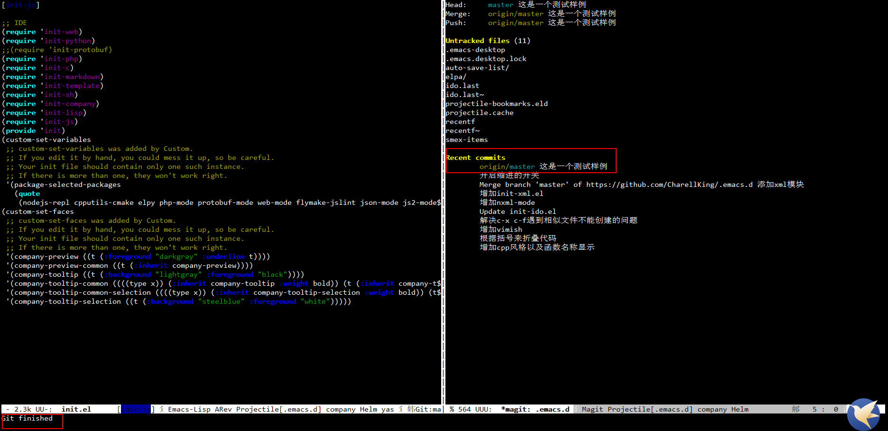